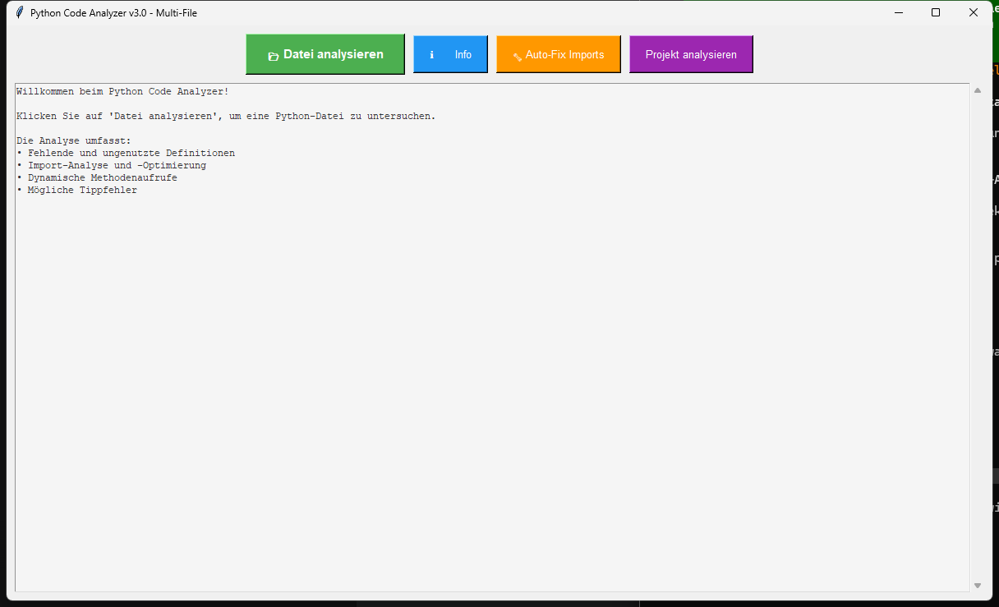

<p align="center">
  
  
  
  
  
</p>

<h1 align="center">MethodenAnalyser</h1>

<h4 align="center">Statischer Python-Code-Analyser mit GUI: findet ungenutzte Imports, tote Definitionen und ähnliche Code-Blöcke.</h4>

---

## Features

| Feature | Beschreibung |
|---------|-------------|
| **AST-Analyse** | Präzise Analyse über den Python Abstract Syntax Tree |
| **Import-Tracking** | Erkennt genutzte und ungenutzte Imports |
| **Methoden-Katalog** | Listet alle Funktionen, Methoden und Klassen |
| **Duplikat-Erkennung** | Findet ähnliche Code-Blöcke mit konfigurierbarem Schwellwert |
| **Framework-Erkennung** | Erkennt implizite Nutzung durch Tkinter, requests, asyncio und weitere Frameworks |
| **Callback-Erkennung** | Identifiziert Callback-Funktionen korrekt als genutzt |
| **Multi-File** | Analysiert ganze Python-Projekte rekursiv |
| **GUI** | Einfache Tkinter-Oberfläche, kein Terminal nötig |

### Was unterscheidet MethodenAnalyser von pylint / flake8 / vulture?

| Feature | MethodenAnalyser | pylint | flake8 | vulture | radon |
|---------|:---:|:---:|:---:|:---:|:---:|
| Ungenutzte Imports | ja | ja | teilweise | ja | nein |
| Ungenutzte Definitionen | ja | teilweise | nein | ja | nein |
| **Code-Ähnlichkeit** | ja | nein | nein | nein | nein |
| **Framework-Erkennung** | ja | teilweise | nein | nein | nein |
| **GUI** | ja | nein | nein | nein | nein |
| **Callback-Erkennung** | ja | nein | nein | teilweise | nein |
| Keine Installation | ja | nein | nein | nein | nein |

---

## Screenshot



Die aktuelle Ansicht zeigt die dateibasierte Analyse mit GUI-Workflow statt reiner CLI-Ausgabe.

---

## Installation

Keine externen Laufzeit-Abhängigkeiten. Nur Python 3.10+ wird benötigt.

```bash
git clone https://github.com/dev-bricks/MethodenAnalyser.git
cd MethodenAnalyser
python MethodenAnalyser3.py
```

Unter Windows kann das Tool auch per Doppelklick auf `START.bat` gestartet werden.

---

## Verwendung

### Einzelne Datei analysieren

1. Tool starten: `python MethodenAnalyser3.py` oder `START.bat`.
2. **Datei analysieren** klicken und eine `.py`-Datei auswählen.
3. Ergebnisse im Ausgabefenster prüfen.

### Ganzes Projekt analysieren

1. **Projekt analysieren** klicken und einen Projektordner auswählen.
2. Alle `.py`-Dateien werden rekursiv durchsucht.
3. Der aggregierte Projekt-Report wird im Ausgabefenster angezeigt.

---

## Beispiel-Output

```text
=== ANALYSE: my_script.py ===

IMPORTS (3 gesamt):
  os        - genutzt
  json      - genutzt
  pathlib   - möglicherweise ungenutzt

DEFINITIONEN (5 gesamt):
  main()
  load_config()
  old_helper() - nicht referenziert

ÄHNLICHE CODE-BLÖCKE (Schwellwert: 80%):
  Zeilen 42-55 <-> Zeilen 88-101 (Ähnlichkeit: 91%)
```

---

## Konfiguration

Im Quellcode anpassbar:

```python
SIMILARITY_THRESHOLD = 0.8    # Schwellwert für Duplikat-Erkennung
WINDOW_GEOMETRY = "1200x700"  # Fenstergröße
```

---

## Datenschutz / Privacy

MethodenAnalyser arbeitet vollständig lokal. Der ausgewählte Python-Code, Dateipfade und Analyseergebnisse werden nicht an den Entwickler oder externe Dienste übertragen.

Release-Artefakte wie EXE-Dateien, lokale Builds und Store-Pakete bleiben außerhalb des Git-Repositorys und gehören in lokale `releases/`-Ordner oder GitHub Releases.

## Repository-Hygiene

Stand: 2026-05-16

- GitHub-Remote: `dev-bricks/MethodenAnalyser`
- Lokaler Branch `master` war vor diesem Pflege-Update synchron mit `origin/master` (`0 ahead / 0 behind`).
- Secret-/Privacy-Check: keine Tokens, Schlüssel oder Credentials in den getrackten Projektdateien gefunden.
- Keine Telemetrie, keine Netzwerkverbindungen und keine Cloud-Synchronisierung aus der Anwendung heraus.
- Lokale Build-, Release-, Coverage-, Cache- und Signierartefakte sind über `.gitignore` ausgeschlossen.
- Interne Wartungsnotizen wie `AUFGABEN.txt` bleiben lokal und werden nicht im Git-Quellbaum veröffentlicht.
- Vor Veröffentlichungen: `git status --short`, Secret-Scan und `python -m py_compile MethodenAnalyser3.py manage_translations.py translator.py` ausführen.

---

## Entwicklung / Verification

```bash
python -m py_compile MethodenAnalyser3.py manage_translations.py translator.py
```

GitHub Actions führt denselben Smoke-Test für Python 3.10 bis 3.12 aus.

---

## Lizenz

Dieses Projekt steht unter der [MIT License](LICENSE).

---

## English

MethodenAnalyser is a static Python code analyzer with AST analysis, duplicate detection, and a small Tkinter GUI.

### Features

- AST-based static analysis
- Duplicate code detection
- Method and class catalog
- Callback and framework awareness
- Recursive project analysis
- No external runtime dependencies

### Installation

```bash
git clone https://github.com/dev-bricks/MethodenAnalyser.git
cd MethodenAnalyser
python "MethodenAnalyser3.py"
```

### License

See [LICENSE](LICENSE) for details.

---

## Haftung / Liability

Dieses Projekt ist eine **unentgeltliche Open-Source-Schenkung** im Sinne der §§ 516 ff. BGB. Die Haftung des Urhebers ist gemäß **§ 521 BGB** auf **Vorsatz und grobe Fahrlässigkeit** beschränkt. Ergänzend gilt der Haftungsausschluss der MIT License.

Nutzung auf eigenes Risiko. Keine Wartungszusage, keine Verfügbarkeitsgarantie, keine Gewähr für Fehlerfreiheit oder Eignung für einen bestimmten Zweck.

This project is an unpaid open-source donation. Liability is limited to intent and gross negligence (§ 521 German Civil Code). Use at your own risk. No warranty, no maintenance guarantee, no fitness-for-purpose assumed.
